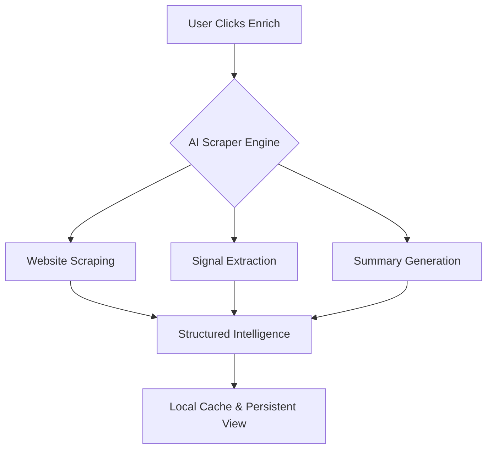
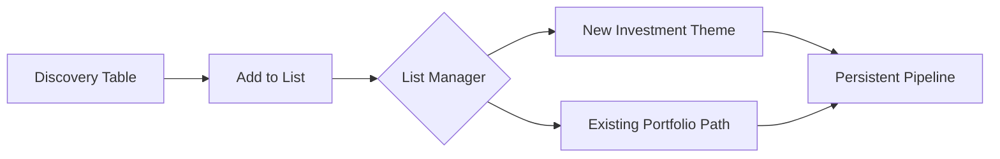

# Help & Guide - VC Scout

Welcome to VC Scout, your precision tool for startup intelligence.

## 🚀 Quick Start Guide

### 1. Discover Startups
Use the **Discovery** page to scan the market. Use the **Sector** and **Stage** filters to narrow down your search to match your fund's thesis.

### 2. Deep Dive with AI Enrichment
Found an interesting company? Click on the row to open their profile. Hit the **✨ Enrich with AI** button to trigger a live scrape. 

Our AI will pull:
*   **Summary**: What they actually do.
*   **Signals**: Derived hiring, product, and growth trends.
*   **Keywords**: Core industry tags.

### 3. Manage Your Pipeline

*   **Add to List**: Click the **+** icon in any row to add a company to an existing theme or create a new one.
*   **Save Search**: Found a filter combo you love? Click **Save Search** to access it later from the sidebar.
*   **Take Notes**: Use the internal notes tab on any profile to keep track of founder calls or internal sentiment.

### 4. Export & Share
Need to run numbers in Excel? Use the **Export CSV** button in Discovery or on your custom Lists to download structured data instantly.

---

## 🛠 Shortcuts
*   `⌘K` or `Ctrl+K`: Global Search (coming soon)
*   `Enter`: Run Search
*   `Click Profile`: View full intelligence

---

## 💡 Pro Tips
> [!TIP]
> Use the **Signals** tab on the profile page to see a chronological history of company events like funding rounds and product launches.

> [!IMPORTANT]
> Enrichment results are cached locally. If a website updates, hit "Enrich" again to refresh the intelligence.
